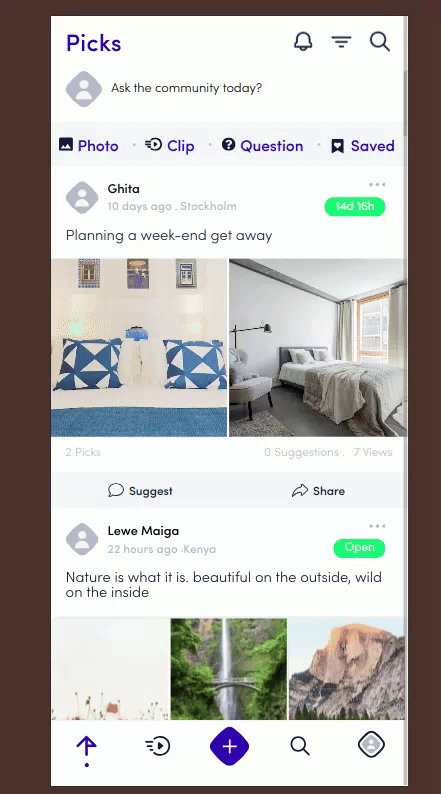
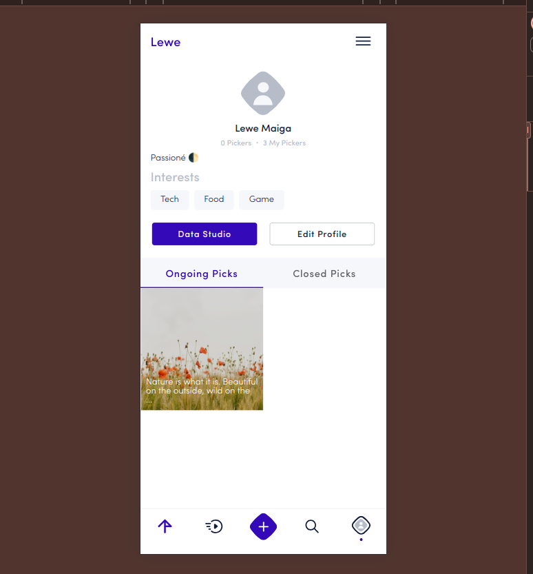

# One Pick Social Network Development Project Analysis Report

## Introduction

This report presents an in-depth analysis of the development project for the One Pick application, a social network aimed at the general public. The aim of this analysis is to identify and resolve technical problems, improve the user experience, correct bugs and suggest modifications to optimise the code and the application in general.

> ⚠️ **Warning**
>
> This document is a suggestion for improving the code structure of the project, as well as the optimisations to be made. The elements are subject to change as I don't have enough experience of the project to implement them. This documentation is a contribution following my own analysis.

### Introducing the One Pick application

One Pick is a social network designed to enable users to share opinions, ideas and views, and to discuss a range of topics based on their interests. Like popular platforms such as Twitter, Instagram and Facebook, One Pick offers a user-friendly interface and interactive features to encourage engagement and communication between users.

### Technologies used

The One Pick application is developed using the following technologies:

**Ionic**: An open-source framework for developing cross-platform mobile applications, offering optimal performance and a consistent user interface on Android and iOS.

**Angular**: A popular web framework for building dynamic, high-performance applications, providing a robust and maintainable code structure.

### Public cible

One Pick's target audience is the general public, encompassing a wide range of users with diverse interests. The application aims to provide an inclusive and attractive platform for all categories of user, facilitating communication and the exchange of ideas.

### Mock-up of the application

A Figma mock-up detailing the final result of the mobile application is available ([👉️ here](https://example.com)). This mock-up serves as a visual reference for evaluating and comparing the expected and actual behaviour of the application, and for identifying where improvements are needed.

## Section 1: Analysis of Technical Problems

This section aims to identify and analyse the technical problems encountered in the development of the One Pick application. As the project is still under development and the first version is not yet on the market, it is crucial to address these issues now to ensure an optimal user experience and efficient performance of the application.

The analysis of technical problems focuses on several key aspects:

1. **Performance issues:** Identification of bottlenecks and areas of the code that need to be optimised to ensure fast loading and a smooth user experience.
2. **Bugs and Malfunctions:** Detection and description of bugs present in the application, along with steps to reproduce them and possible solutions.
3. **User Interface Problems:** Assessment of the user interface to identify non-functional or misaligned elements that could adversely affect the user experience.

This analysis is essential to better understand the current and future needs of the project. It will provide clear, actionable recommendations for correcting identified problems, optimising the code, and improving the overall user experience. By addressing these aspects at the earliest stages of development, we ensure that One Pick is ready to deliver a high quality experience at launch.

### Performance issues

In the development of the One Pick application, performance optimisation is a crucial issue to ensure a fluid and responsive user experience. Slowness and technical bottlenecks can seriously affect user engagement and the overall performance of the application. Here is an overview of the main performance problems encountered and recommendations for resolving them.

#### Image loading times

One of the most notable problems concerns image loading times. Currently, images take too long to be displayed, which slows down the application and degrades the user experience. The main cause of this slowness is the failure to resize and compress images before sending them to the application.

To remedy this situation, it is essential to implement image compression and resizing techniques in the backend. In addition, on the frontend, lazy loading would allow images to be loaded only when they become visible on the screen, thus reducing the initial loading time. The use of modern image formats such as WebP can also help to reduce file size while maintaining high visual quality.

```html
<!-- Example of lazy loading for images -->

```

#### Number of items retrieved

Another performance problem relates to the number of items retrieved at one time. When a large number of elements are loaded simultaneously, this overloads the application and the servers, slowing down response time. The solution to this problem is to implement a dynamic element loading system, such as infinite scroll, which allows elements to be retrieved progressively as the user scrolls down the page. Limiting the number of elements retrieved per request, for example to 25 elements, can also help to reduce the load on servers and improve responsiveness.

```ts
// Example of parameters for retrieving posts with pagination
offset = 0;
limit = 25; // Reduce the number of items retrieved per request
```

#### Bundle size

The size of the bundle is also a critical issue. Currently, the bundle is excessively heavy, which slows down the initial loading of the application. The large size of the bundle can be attributed to the inclusion of resource-hungry features that are not always used by users. To solve this problem, we recommend using code splitting to load heavy functionality only when necessary. In addition, it is essential to analyse and optimise dependencies to ensure that only the necessary libraries are included in the bundle.


In conclusion, greater attention to image management, dynamic loading of elements and bundle size is needed to improve the performance of the One Pick application. These adjustments will optimise loading time, reduce server overload and guarantee a fluid, fast user experience.

### Bugs and malfunctions

Identifying and fixing bugs is essential to ensuring a smooth user experience. In this section, we look at the major problems encountered in the One Pick application, focusing on their impact and possible solutions.

#### Problem with multiple modal windows

One of the most notable bugs concerns the opening of multiple modal windows during a slow connection. When a user clicks a button several times while the application is loading, several modal windows may open simultaneously, creating confusion and visual overload.

This problem occurs because the button remains active and continues to send requests before the first request is completely processed. To avoid this situation, we recommend disabling the button immediately after the first click until the current action has been completed. This approach will prevent multiple clicks and ensure a smoother interaction.



#### Problem displaying profile images

Another significant bug concerns the display of profile images in the mobile application. Although these images appear correctly in browsers, they are not displayed in the mobile application due to an unsecured connection (HTTP). Android and iOS systems require secure connections (HTTPS) to load resources correctly.

To correct this issue, it is crucial to enable HTTPS for all connections to ensure that profile images and other assets are loaded correctly. Until HTTPS is fully implemented, using the [ssl-skip](https://github.com/jcesarmobile/ssl-skip) package can temporarily bypass this restriction.

### User Interface Problems

Analysis of the user interface reveals a number of issues that can detract from the overall experience of the application. These include visual inconsistencies and ergonomic shortcomings that merit special attention to improve user interaction.

#### Inconsistencies in spacing

A recurring problem is inconsistent spacing, particularly with regard to padding and margins. Some elements of the user interface do not have uniform spacing, which creates visual inconsistency and can be confusing for users.

To solve this problem, it is important to review and standardise CSS styles across all the pages and components of the application. The use of CSS variables or a design system can help to maintain uniformity in spacing and improve the overall presentation.

#### Usability issues

In terms of usability, the application has a number of shortcomings, particularly when it comes to carrying out certain common actions. The 'Pick' system, for example, currently requires two clicks: one to select the image and another to confirm the action. Simplifying this process to a single click would improve the fluidity and efficiency of interactions.

In addition, in the Clips tab, actions linked to videos are only accessible at the end of playback. To facilitate interaction, it would be preferable to make these actions available from the start of playback.

#### Text contrast problem on images

The contrast of text displayed on images is sometimes insufficient, making it difficult to read, especially when the background image has similar colours to the text. To improve legibility, the addition of a mask or semi-transparent background behind the text is recommended. The use of algorithms to automatically adjust contrast according to the dominant colours of the image could also be considered.



In conclusion, improving the technical aspects related to performance, bugs and the user interface is essential to ensuring an optimal experience in the One Pick application. By addressing these issues with appropriate solutions, we can improve the responsiveness, functionality and usability of the application, ensuring a successful launch and a high-quality user experience.

## Section 2: Expected vs Actual Behaviour

As part of the development of the One Pick application, it is crucial to assess the gaps between expected and observed behaviour. This analysis enables us to detect any malfunctions and suggest improvements to ensure an optimal user experience. Here are the main points of observation.

### Main functionalities

In developing the One Pick application, real-time publication management plays a crucial role in ensuring a fluid and interactive user experience. Currently, a notable limitation is the need to manually refresh the news feed to see new content. This need to refresh the page every time a user posts content or interacts with the application causes considerable frustration and undermines the efficiency of the information flow.

The application's core functionality, such as the ability to publish various types of content - TikTok-style video clips, photos, polls and quizzes - as well as the ability to comment, like and share, is essential to maintaining user engagement. However, a significant problem has been identified when adding new posts: the creation of certain types of publication, apart from simple images, does not work as expected. Currently, the application only allows images to be published, while other publication formats such as videos and polls remain inaccessible.

This limitation not only restricts the variety of content that users can share, but also impacts overall engagement with the application. Indeed, for a modern application focused on a diversity of interactions, it is imperative that each type of publication is functional and accessible.

To solve this problem, it would be beneficial to re-evaluate the content type management process in Angular. One possible solution would be to optimise the publishing code to include all post formats and implement a real-time update mechanism using WebSocket. This approach would not only simplify publication management but also improve the responsiveness of the application, providing a much smoother and more consistent user experience.

In conclusion, the ability to publish and view content in real time is essential to the success of One Pick. Improving these technical aspects will help to meet user expectations and enhance interaction within the platform. To move forward, it is crucial to address these technical challenges with appropriate solutions, ensuring that each essential feature works as intended and contributes to an enriching user experience.

### Navigation

Navigation within the One Pick application is generally satisfactory, allowing users to move between the different sections with a certain fluidity. However, to further enhance the user experience, it is essential to refine certain aspects of navigation, in particular animations and transitions between pages.

Although the navigation mainly meets current needs, it could benefit from a particular focus on transitions. Adding more subtle animations and fluid transitions between pages can not only improve the aesthetics of the application, but also make the experience more immersive and intuitive. For example, animations when moving from one section to another or visual transitions between elements can help to guide the user in a more natural and pleasant way.

At the same time, it would be useful to examine the loading times between sections. Optimising response times can considerably reduce waiting times, thus avoiding any impression of slowness or jerkiness. Using techniques such as lazy loading for sections that are not immediately visible or preloading essential data can help to make navigation more fluid and responsive.

En résumé, bien que la navigation actuelle de l'application One Pick soit efficace, l'intégration de transitions visuelles raffinées et l'optimisation des temps de chargement sont des étapes clés pour améliorer l’expérience globale. Ces ajustements permettront non seulement de rendre l'application plus agréable à utiliser, mais aussi de renforcer l’engagement des utilisateurs en offrant une expérience plus fluide et attrayante.

### Interactions Utilisateur

When it comes to user interaction in One Pick, my first impressions weren't particularly enthusiastic, but they weren't catastrophic either. While the foundation is solid, some inaccuracies marred the experience, especially when you consider that the app is aimed at a broad audience.

The application offers a good foundation, but my attention to detail reveals that there's not much missing to reach an optimal level. As a social network user, I'm primarily interested in staying informed, asking for advice and getting away from it all. To meet these expectations, One Pick needs to offer interactions that are not only functional but also intuitive and natural.

One crucial aspect is the 'Pick' system, which allows users to select content they like. Currently, this action requires two clicks: one to choose the image and another to confirm. Given that this is one of the most frequent interactions, simplifying the process to a single click would considerably improve the efficiency and fluidity of the experience.

What's more, in the Clips tab, video-related functionalities - such as comments and sharing - are only available at the end of playback. This restriction slows down interaction and can reduce engagement. Making these actions available from the start of playback would be beneficial for maintaining user interest and facilitating their interaction with the content.

Another area for improvement is the legibility of text superimposed on images. Sometimes the contrast between the text and the background image is insufficient, making it difficult to read. Adding a mask or semi-transparent background behind the text could solve this problem, making the information clearer and more accessible.

In short, although the basis of user interaction in One Pick is promising, a few tweaks can greatly improve the experience. By simplifying processes, making actions more accessible and improving readability, the application can offer a more fluid and enjoyable experience, meeting the varied needs of users in a consistent and natural way.

### Conclusion

A thorough analysis of the One Pick application has highlighted several areas that require immediate attention to enhance user experience and overall performance. The identified issues fall into four main categories: performance problems, bugs and malfunctions, inconsistencies in user interface, and difficulties related to interactions.

**Summary of Key Issues Identified:**

- **Performance:** There are long image loading times, a high number of elements being retrieved simultaneously, and an excessive bundle size. These issues negatively impact the application’s responsiveness and user satisfaction.
- **Bugs and Malfunctions:** Multiple modal windows opening during a slow connection and profile images not displaying correctly on mobile devices due to unsecured connections are critical issues.
- **User Interface:** Inconsistencies in spacing, ergonomic shortcomings in user interactions, and insufficient text contrast on some images need addressing.
- **User Interactions:** The processes for selecting content and accessing video actions need improvements to offer a smoother and more intuitive experience.

**Prioritization of Solutions:**

1. **Address Performance Issues:** Priority should be given to optimizing image loading times, implementing dynamic element loading, and reducing bundle size. These improvements will directly impact the application's responsiveness and user satisfaction.

2. **Fix Critical Bugs:** Resolving issues related to multiple modal windows and profile image display should be addressed promptly to prevent disruptions and ensure a consistent user experience across all platforms.

3. **Enhance User Interface:** Standardizing spacing, improving interaction ergonomics, and adjusting text contrast on images are essential for better usability and accessibility of the application.

4. **Optimize User Interactions:** Simplifying content selection processes and making video actions immediately accessible are necessary adjustments for smoother interactions.

**General Recommendations:**

To ensure long-term success, it is recommended to continue monitoring and evaluating the application’s performance throughout its lifecycle. A proactive approach to testing and user feedback is crucial for quickly identifying and addressing issues. Additionally, establishing regular update and maintenance mechanisms will be key to keeping the application aligned with user expectations and technological standards.

Finally, while this analysis has covered several critical aspects, it is important to note that inspections are not yet complete. Further points may be identified that will require additional adjustments to perfect the application. Ongoing evaluation and continuous improvement will be vital to the long-term success of One Pick.
